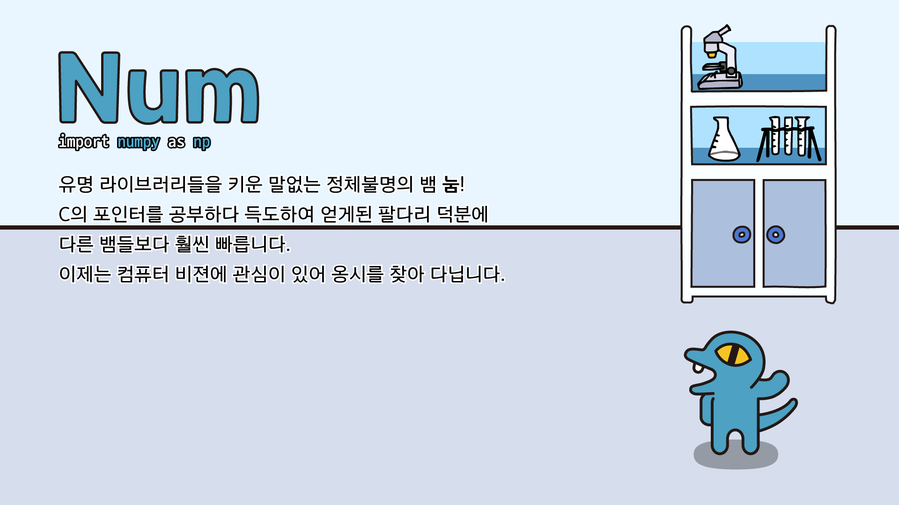

# Num


- Con is now... Num 눔

<br>



- [PC 배경화면 (16x9, 1920x1080) 다운로드](img/pc_1920_1080/num_pc.jpg)
- [모바일 배경화면 (9x18.5, 1080x2220) 다운로드](img/mobile_1080_2220/num_mobile.jpg)
- [정사각형 일러스트 (2220x2220) 다운로드](img/square_2220_2220/num_square.jpg)
- [어도비 일러스트 AI 파일 다운로드](illustration_files/num.ai)

!!! note " "
    유명 라이브러리들을 키운 말없는 정체불명의 뱀 **눔**!
    <br>
    C의 포인터를 공부하다 득도하여 얻게된 팔다리 덕분에 다른 뱀들보다 훨씬 빠릅니다.
    <br>
    이제는 컴퓨터 비젼에 관심이 있어 옹시를 찾아 다닙니다.

## NumPy

```python
import numpy as np
```

- PIP을 통한 설치: ``` pip install numpy ```
- 공식 다큐먼트: [링크](https://numpy.org/doc/1.21/)
- Google Colab에서 써보기: [](https://colab.research.google.com/github/FeetCodingHommy/pypyo-friends/blob/master/jupyternotebooks/num.ipynb)