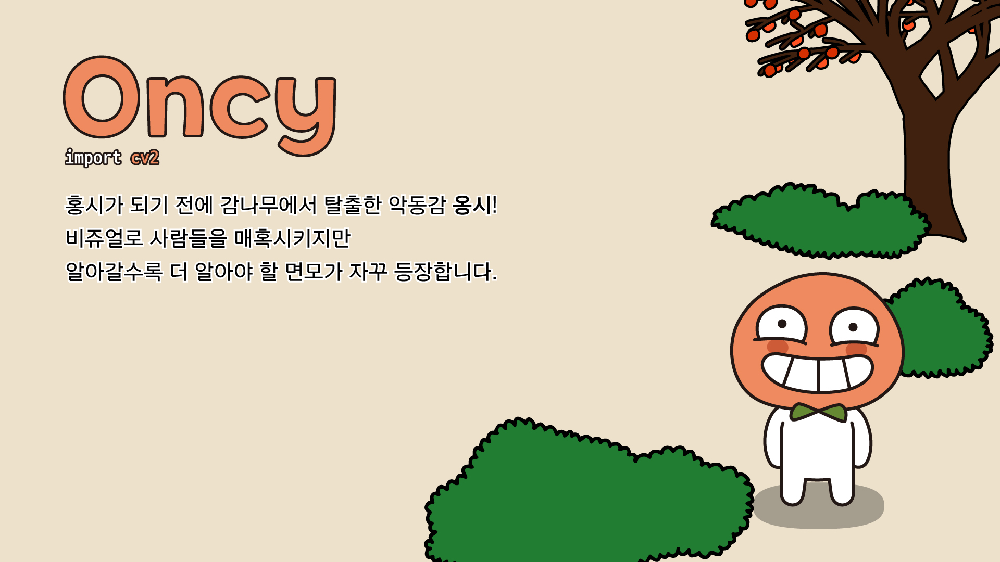

# Oncy


- Apeach is now... Oncy 옹시

<br>



- [PC 배경화면 (16x9, 1920x1080) 다운로드](img/pc_1920_1080/oncy_pc.jpg)
- [모바일 배경화면 (9x18.5, 1080x2220) 다운로드](img/mobile_1080_2220/oncy_mobile.jpg)
- [정사각형 일러스트 (2220x2220) 다운로드](img/square_2220_2220/oncy_square.jpg)
- [어도비 일러스트 AI 파일 다운로드](illustration_files/oncy.ai)

!!! note " "
    홍시가 되기 전에 감나무에서 탈출한 악동감 **옹시**!
    <br>
    비쥬얼로 사람들을 매혹시키지만 알아갈수록 더 알아야 할 면모가 자꾸 등장합니다.

## OpenCV

```python
import cv2
```

- PIP을 통한 설치: ``` pip install opencv-python ```
- 공식 다큐먼트: [링크](https://docs.opencv.org/4.5.2/d6/d00/tutorial_py_root.html)
- Google Colab에서 써보기: [](https://colab.research.google.com/github/FeetCodingHommy/pypyo-friends/blob/master/jupyternotebooks/oncy.ipynb)