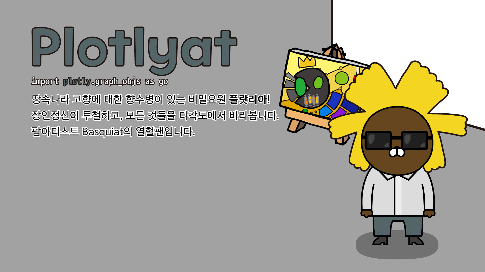

# Plotlyat


- JayG is now... Plotlyat 플랏리앗

<br>



- [PC 배경화면 (16x9, 1920x1080) 다운로드](img/pc_1920_1080/plotlyat_pc.jpg)
- [모바일 배경화면 (9x18.5, 1080x2220) 다운로드](img/mobile_1080_2220/plotlyat_mobile.jpg)
- [정사각형 일러스트 (2220x2220) 다운로드](img/square_2220_2220/plotlyat_square.jpg)
- [어도비 일러스트 AI 파일 다운로드](illustration_files/plotlyat.ai)

!!! note " "
    땅속나라 고향에 대한 향수병이 있는 비밀요원 **플랏리아**!
    <br>
    장인정신이 투철하고, 모든 것들을 다각도에서 바라봅니다.
    <br>
    팝아티스트 Basquiat의 열혈팬입니다.

## Plot.ly

```python
import plotly.graph_objs as go
```

- PIP을 통한 설치: ``` pip install plotly ```
- 공식 다큐먼트: [링크](https://plotly.com/python-api-reference/)
- Google Colab에서 써보기: [](https://colab.research.google.com/github/FeetCodingHommy/pypyo-friends/blob/master/jupyternotebooks/plotlyat.ipynb)