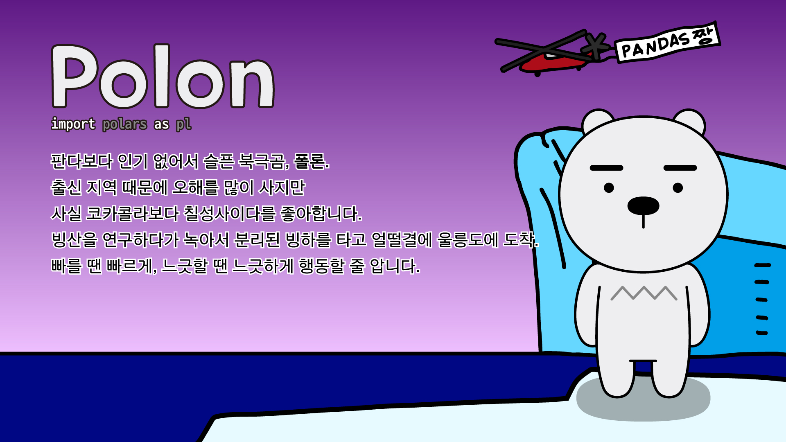

# Polon


- Ryan is now... Polon 폴론

<br>



- [PC 배경화면 (16x9, 1920x1080) 다운로드](img/pc_1920_1080/polon_pc.jpg)
- [모바일 배경화면 (9x18.5, 1080x2220) 다운로드](img/mobile_1080_2220/polon_mobile.jpg)
- [정사각형 일러스트 (2220x2220) 다운로드](img/square_2220_2220/polon_square.jpg)
- [어도비 일러스트 AI 파일 다운로드](illustration_files/polon.ai)

!!! note " "
    판다보다 인기 없어서 슬픈 북극곰, **폴론**.
    <br>
    출신 지역 때문에 오해를 많이 사지만 사실 코카콜라보다 칠성사이다를 좋아합니다.
    <br>
    빙산을 연구하다가 녹아서 분리된 빙하를 타고 얼떨결에 울릉도에 도착.
    <br>
    빠를 땐 빠르게, 느긋할 땐 느긋하게 행동할 줄 압니다.

## Polars

```python
import polars as pl
```

- PIP을 통한 설치: ``` pip install polars ```
- 공식 다큐먼트: [링크](https://pola-rs.github.io/polars-book/user-guide/index.html)
- Google Colab에서 써보기: [](https://colab.research.google.com/github/FeetCodingHommy/pypyo-friends/blob/master/jupyternotebooks/polon.ipynb)